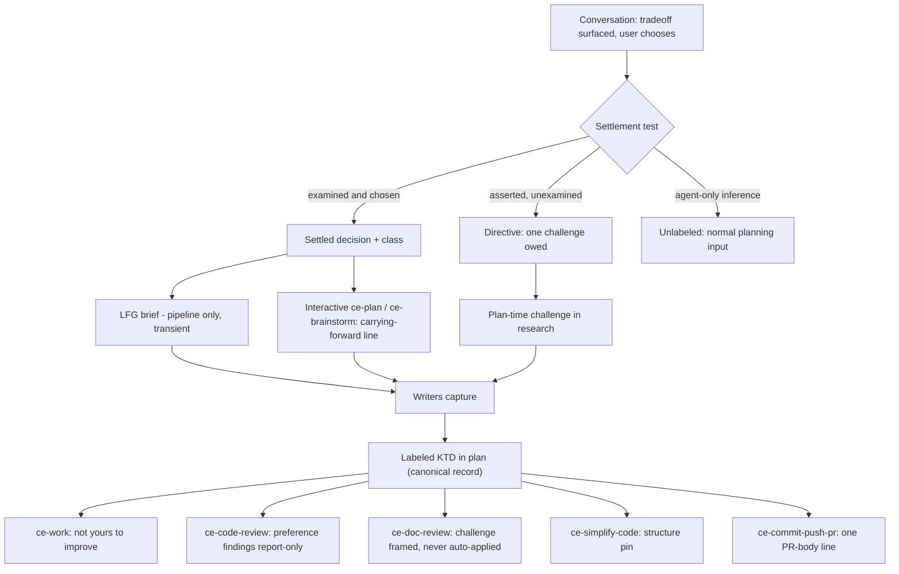
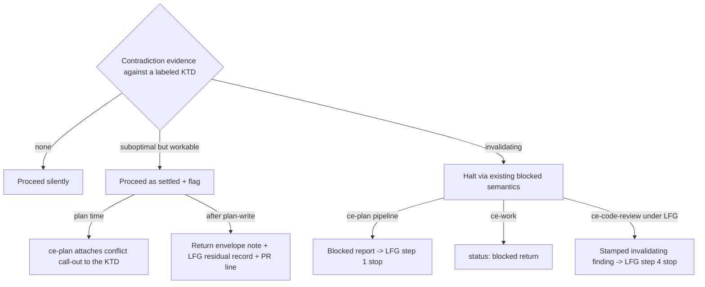
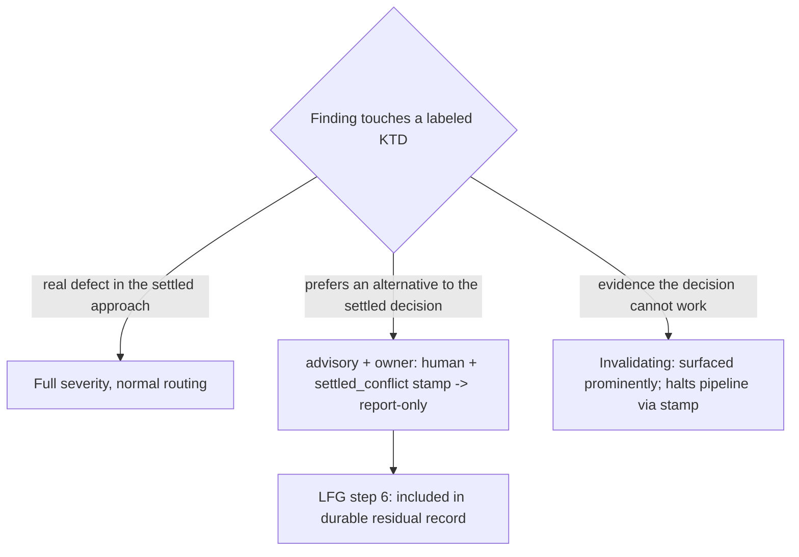

# Session-Settled Decision Provenance - Plan

## Goal Capsule

- **Objective:** Decisions already examined-and-chosen in the invoking conversation flow through the planning/execution pipeline as provenance-labeled constraints that are augmented, never re-asked, and contradicted only on evidence — fixing the re-litigation symptom of issue #1131.
- **Authority:** This plan's Requirements and KTDs govern; repo conventions in the project's active instructions and `docs/solutions/skill-design/portable-agent-skill-authoring.md` govern how every skill edit is authored; user instructions override both.
- **Execution profile:** Skill-prose edits across eight skills plus contract tests. No converter/CLI code changes. Behavioral validation is skill-creator evals (not CI); mechanical validation is `bun test`.
- **Stop conditions:** Stop and surface if an edit would require renaming an existing stable metadata field, adding a mode token to ce-plan/ce-brainstorm (they detect pipeline context, they don't parse tokens), or weakening an existing pinned contract string in a way its test does not cover.
- **Tail ownership:** Caller owns commit/PR tail; this plan does not prescribe landing strategy.

---

## Product Contract

### Summary

Add a session-settled decision mechanism: ce-plan and ce-brainstorm classify conversation-carried decisions with a settlement test, record settled ones as provenance-labeled Key Technical Decisions, and carry them as weighted constraints; LFG composes a transient brief for pipeline runs; downstream skills (ce-work, ce-code-review, ce-doc-review, ce-simplify-code, ce-commit-push-pr) read the label and stop re-litigating what the user already decided, while a severity ladder keeps genuine contradiction evidence flowing.

### Problem Frame

Issue #1131: a user works a problem interactively until the solution is agreed, then invokes `/lfg` — and the pipeline re-plans from scratch, re-reviews the same decisions repeatedly, and sometimes ships something different from what was agreed. The mechanism is concrete: LFG passes ce-plan only its invocation arguments; ce-plan's research runs in fresh subagents that never saw the conversation; headless mode resolves open questions to recommended defaults; and no skill distinguishes "the user chose X over Y after seeing the tradeoff" from "the agent assumed X." Decisions recorded in a brainstorm file get preservation discipline (Phase 0.3); decisions that live only in the conversation get none. The fix is not a fast path that skips planning — it is weighting plus legibility: planning always runs, but settled decisions enter as constraints with visible provenance, so every downstream pass knows which questions have already been answered and by whom.

### Requirements

**Provenance contract**

- R1. A settled decision is recorded on its Key Technical Decision entry as a self-contained annotation — provenance class, rejected alternative, one-line reason — readable by a consumer with no access to the conversation.
- R2. Exactly two provenance classes at launch: `user-directed` (the user chose against or between surfaced options) and `user-approved` (the agent proposed with the tradeoff surfaced; the user assented). An agent never labels its own unexamined proposal (no self-settling).
- R3. The annotation is visible English text with a stable greppable stem (`session-settled:`), rendered identically in markdown and HTML plans.
- R4. A consumer that does not recognize the annotation sees a normal KTD; worst-case degradation is today's re-litigation, never corruption. No sidecar files, no frontmatter registry, no numeric weights, no mutable lifecycle field.

**Capture (writers: ce-plan, ce-brainstorm)**

- R5. Conversation-carried decisions are classified by the settlement test — the decision survived examination (a surfaced tradeoff or alternative followed by user choice). Unexamined assertions are directives, not settled decisions.
- R6. Settled decisions are never re-asked: scoping-synthesis gates present them as "carrying forward" lines rather than call-outs, and question phases skip them.
- R7. Challenge conservation: a directive receives exactly one in-pipeline challenge, and the challenge is recorded by settling its outcome into a labeled KTD — the plan is the ledger. A pipeline-surfaced challenge with no user to answer it may legitimately resurface as the divergent/residual class.
- R8. A plan KTD that instantiates a labeled brainstorm Key Decision inherits the label and cites the source decision.

**Contradiction handling**

- R9. Severity ladder on contradiction evidence: nothing found → proceed silently; suboptimal-but-workable → proceed as settled and flag (at plan time, ce-plan attaches a conflict call-out to the KTD; after plan-write, flags ride structured returns, LFG's residual record, and the PR line — never plan mutation); invalidating (infeasible, wrong-thing, destructive) → halt through the consumer's existing blocked semantics.
- R10. A settled label never suppresses defect findings: demotion keys on finding type (alternative-preference against a labeled KTD), and a real defect inside a settled approach keeps full severity.

**Pipeline orchestration (LFG)**

- R11. LFG step 1 composes a transient distilled brief — direction; settled decisions each with class, rejected alternative, and one-line reason (required fields); open areas; a report-conflicts standing line — topically scoped to the feature being shipped. An entry whose composer cannot state a rejected alternative demotes to a directive. The brief dies once the plan is written, and the step-1 retry reuses the brief verbatim.
- R12. Settlement-conflict review findings carry a machine-visible stamp naming the conflicting KTD; stamped findings enter LFG's durable residual record, and a stamped finding classified invalidating stops the pipeline before shipping.

**Consumers**

- R13. ce-work treats labeled KTDs as not-yours-to-improve, scoped to labeled KTDs only; an invalidating discovery is a blocker return, never an auto-accepted residual; proceed-and-flag notes ride the return envelope.
- R14. ce-code-review routes alternative-preference findings against labeled KTDs to the report-only queue in every mode, including interactive apply; when no plan is discovered, coverage notes that settlement suppression was not evaluated.
- R15. Pipeline invocations of ce-simplify-code receive the plan path with labeled KTDs named as structure pins, and ce-simplify-code honors externally passed structure pins.
- R16. ce-commit-push-pr writes one static provenance line in the PR body when a labeled plan is in hand; standalone invocations without a plan omit it (documented degradation).
- R17. ce-doc-review personas recognize the label: challenges to settled KTDs are framed as infeasibility-versus-preference and never auto-applied; the headless safe-auto pass never strips the annotation. Deepening may append rationale or a conflict call-out to a labeled KTD but never removes the annotation or inverts the decision; an interactive re-deepen acceptance that changes a labeled KTD updates its label (`user-approved`).

**Verification**

- R18. The annotation stem, enum values, and cross-skill contract strings are pinned deterministically in `bun test`, with each new guard proven red on injected one-sided drift before merge.
- R19. Behavioral evals run via skill-creator on both Claude and Codex, covering carry, no-re-ask, self-settling negative, restraint negative, over-deference guardrail, demotion boundary, degradation, ladder-in-pipeline, and fresh-reader parity.

### Acceptance Examples

- AE1. **Carry.** Given a session where the agent proposed Y and the user said "no, do X," when `/lfg` runs, then the plan contains a KTD for X labeled `session-settled: user-directed` naming Y as the rejected alternative, and no stage re-opens Y.
- AE2. **One challenge for directives.** Given a cold prompt "build it with X" where X was never examined, when planning runs, then X is challenged exactly once (plan-time research), and the outcome lands as a labeled or unlabeled KTD — later stages do not re-challenge.
- AE3. **Defects keep severity.** Given a labeled KTD whose implementation contains a real bug, when ce-code-review runs, then the bug finding keeps its full severity and actionability.
- AE4. **Preference demotes.** Given a labeled KTD, when a reviewer finds "alternative Z would be cleaner," then the finding routes report-only with a stamp naming the KTD, in interactive and agent modes alike.
- AE5. **No self-settling.** Given a session where the agent proposed X and the user never engaged with it, when the plan is written, then X carries no `session-settled:` annotation.
- AE6. **Invalidating halts.** Given research or review evidence that a settled decision cannot work, when the pipeline is non-interactive, then the run stops as blocked with the reason — the PR does not open.

### Scope Boundaries

- **Deferred to Follow-Up Work:** the pipeline's overall review-pass count and speed (the other half of #1131); per-requirement (R-ID) provenance labels; a third enum class for evidence-settled decisions; provenance in standalone interactive ce-commit-push-pr runs with no plan; ce-debug/ce-ideate as consumers; any cross-session settled-decision store outside the plan artifact.
- **Outside this product's identity:** agents minting `user-directed` provenance for their own choices; a mutable settledness lifecycle on plans; a sidecar settled-decisions file; a PR-body outstanding-items ledger (the PR line is a static description element only).

---

## Planning Contract

### Key Technical Decisions

- KTD1. **Annotation shape: inline English parenthetical on the KTD, pinned only at the stem and enum.** Shape: `(session-settled: user-directed — chosen over <alternative>: <one-line reason>)`. Protocol pins are the stem `session-settled:` and the enum `user-directed` / `user-approved`; the rest is free-form prose. English-sentence form (not a sigil) is the old-version defense: doc-review prose-economy passes read a parenthetical sentence as intentional content, a bare marker as strippable clutter. Sanctioned in `plan-sections.md` so it is decision provenance (like the existing `(see origin: <path>)`), not process exhaust.
- KTD2. **Two classes now; evidence-settled stays unlabeled.** Decisions settled by evidence (blindspot-pass "territory-answered") are re-derivable, so re-litigating them is cheap and correct — they remain ordinary KTDs. The enum is additive-extensible later because unrecognized annotations degrade harmlessly (R4).
- KTD3. **Settlement classification is judgment; everything downstream of it is protocol.** The test is stated as a principle plus one contrast pair ("user rejected option A after seeing the tradeoff → settled; user said 'sounds good' to a passing mention → user-approved at most; agent-only inference → no label"). Enum values, routing rules, gates, and required fields are explicit and falsifiable.
- KTD4. **The plan is the sole challenge ledger.** A challenge is recorded only by settling its outcome into the plan as a (labeled or revised) KTD. No cross-skill challenge registry; an unanswered pipeline-surfaced challenge resurfaces as the divergent/residual class. This reuses the plan-is-canonical decision instead of inventing state.
- KTD5. **The brief is transient and self-enforcing.** Required fields (rejected alternative + reason) make the settlement test a format constraint: a claim that cannot state its rejected alternative mechanically demotes to a directive. This protects the Assumptions firewall (`synthesis-summary.md` forbids unvalidated bets in KTDs) without ce-plan having to interrogate conversation history it may no longer have.
- KTD6. **Post-plan conflict flags never mutate the plan.** ce-work and ce-code-review are contractually non-mutating toward the plan; flags ride ce-work's return envelope, LFG's committed residual record (existing precedent), and the PR line. Only plan-time conflicts (Phase 1 research) are written into the artifact, by ce-plan, which owns it then.
- KTD7. **ce-code-review expresses demotion in its existing vocabulary.** A Stage 5 rule (sibling of the existing weak-signal demotion) routes alternative-preference-vs-labeled-KTD findings to `autofix_class: advisory` + `owner: human` (report-only queue), stamps the finding with a `settled_conflict` field naming the KTD, and a one-line Stage 5c exception makes stamped findings report-only in interactive apply too. No new "FYI tier" is invented. Findings against `plan_source: inferred` plans honor suppression weakly (advisory precedent), stated explicitly.
- KTD8. **Blind lenses, sighted synthesis.** Settlement annotations are excluded from reviewer bundles and the Stage 2 intent summary (reusing the existing per-reviewer exclusion mechanism); the orchestrator triages post-hoc. Anchored-refuter independence is preserved; suppression happens where autofix_class routing already lives.
- KTD9. **Writers share a byte-duplicated `references/settled-decisions.md`; consumers get inline rules.** The reference carries the schema, taxonomy, contrast pair, and no-self-settling rule for ce-plan and ce-brainstorm (parity-tested, per the repo's shared-asset convention). Consumer skills need only the token and a routing rule — always-on, load-bearing, therefore inline in each SKILL.md (post-menu-routing learning), pinned by contract tests rather than a parity file.
- KTD10. **Deepening gets a stability rule mirroring U-ID stability.** Deepening may append rationale or a conflict call-out to a labeled KTD; it never removes the annotation or inverts the decision. Contradiction evidence routes through the severity ladder. Interactive re-deepen acceptance is a new settlement and relabels the KTD `user-approved`.
- KTD11. **Enforcement surface is the plan artifact.** Settlement guarantees hold exactly when the plan is in hand (discovered, cited, threaded); every other path — no plan found, older consumer, standalone invocation — degrades to today's behavior. Stated once as a documented boundary so per-consumer gaps read as boundaries, not bugs.
- KTD12. **Caller-neutral input binding.** The brief is "input this skill was invoked with — from the user or a calling skill," matching the repo's established binding language, so pipeline-passed briefs are honored on every host and no `$ARGUMENTS`-style Claude-only token appears.

### High-Level Technical Design

Settled-decision lifecycle across the pipeline:

Contradiction severity ladder (any stage, any consumer):

Finding triage in ce-code-review when a labeled KTD is in scope:

### Sequencing

Contract before writers before consumers: a labeled plan nobody writes is safe (degradation), a consumer keying on a label nobody writes is dead code. U1 → U2/U3 → U4 → U5–U8, with U9/U10 closing. Contract-test updates land in the same diff as the strings they pin (U4 especially — LFG's step-1 strings are already pinned by two test files).

---

## Implementation Units

| U-ID | Title | Key files | Depends on |
|---|---|---|---|
| U1 | Provenance contract in the artifact layer | ce-plan plan-sections/rendering refs, brainstorm-sections | — |
| U2 | ce-plan capture, carry, and ladder | ce-plan SKILL.md + 3 refs | U1 |
| U3 | ce-brainstorm capture and carry | ce-brainstorm SKILL.md + 2 refs | U1 |
| U4 | LFG brief and pipeline gates | lfg SKILL.md + 2 test files | U1 |
| U5 | ce-work consumer | ce-work SKILL.md + shipping ref | U1 |
| U6 | ce-code-review triage | ce-code-review SKILL.md | U1 |
| U7 | PR-body provenance line | ce-commit-push-pr ref | U1 |
| U8 | Maintenance-pass guards | ce-doc-review personas, ce-simplify-code | U1 |
| U9 | Mechanical guards and drift proof | tests/ | U1–U8 |
| U10 | Behavioral eval pack | skill-creator evidence | U2–U8 |

### U1. Provenance contract in the artifact layer

- **Goal:** The annotation is a sanctioned, format-independent part of the plan artifact contract.
- **Requirements:** R1, R2, R3, R4, R8
- **Dependencies:** none
- **Files:** `skills/ce-plan/references/plan-sections.md`, `skills/ce-plan/references/markdown-rendering.md`, `skills/ce-plan/references/html-rendering.md`, `skills/ce-brainstorm/references/brainstorm-sections.md`
- **Approach:** In `plan-sections.md`, extend the KTD description with the annotation shape (KTD1), the two-class enum with behavioral definitions, the no-self-settling rule, the inherit rule (a KTD instantiating a labeled brainstorm Key Decision inherits and cites it), and an explicit note that the annotation is decision provenance, not process exhaust. Add matching one-line rendering rules to both rendering references (visible text in both formats; markdown: part of the KTD bullet; HTML: visible text, never an attribute). In `brainstorm-sections.md`, allow the same annotation on Key Decisions entries.
- **Patterns to follow:** the existing `(see origin: <path>)` per-decision citation; the `product_contract_source` open-ended source-string clause; the U-ID stability rule's placement.
- **Test scenarios:** extend `tests/skills/unified-plan-artifact-contract.test.ts` — plan-sections.md contains the stem `session-settled:` and both enum values; both rendering references mention the annotation; brainstorm-sections.md contains the stem.
- **Verification:** `bun test` green; grep for the stem hits all four files.

### U2. ce-plan capture, carry, and ladder

- **Goal:** ce-plan classifies, carries, records, and defends settled decisions in both interactive and pipeline modes.
- **Requirements:** R5, R6, R7, R8, R9 (plan-time arm), R11 (consumption side), R17 (deepening arm)
- **Dependencies:** U1
- **Files:** `skills/ce-plan/SKILL.md`, `skills/ce-plan/references/synthesis-summary.md`, `skills/ce-plan/references/deepening-workflow.md`, `skills/ce-plan/references/settled-decisions.md` (new)
- **Approach:** New `references/settled-decisions.md` carries the schema, taxonomy, settlement principle + contrast pair, no-self-settling rule, and brief-consumption rules (KTD9), loaded from an inline stub at the point of use. SKILL.md edits, each at its owning phase: recognize session-settled input alongside the Phase 0.2 source hierarchy with caller-neutral binding (KTD12); Phase 0.3-style preservation applied to settled decisions (conflicts become call-outs, never silent rewrites); Phase 1.1 passes settled decisions in the research context summary with the report-conflicts standing line, excluding annotations from any adversarial/validation dispatch; Phase 2 never re-asks a settled decision and spends the one challenge on directives (R7); Phase 5.1 checklist line — every unit implementing a settled decision cites the labeled KTD (this is what makes ce-work's citation channel carry the label); Phase 5.2 authors labeled KTDs including brainstorm inheritance; pipeline mode returns a recognized blocked report when brief-settled decisions are invalidated by research (consumed by U4). In `synthesis-summary.md`: settled decisions are Stated-with-provenance in the internal draft, rendered as "Carrying forward:" lines in stage 2, excluded from call-outs by the keep test; the counter-warning section gains the settled class. In `deepening-workflow.md`: the KTD stability rule (KTD10) and the interactive re-accept relabeling.
- **Patterns to follow:** the Phase 0.3 Product Contract preservation note; the existing load-stub shape ("Read `references/…` before …; it carries …"); scaffolded-questions pipeline handling in Phase 2.
- **Test scenarios:** contract test — SKILL.md region for Phase 2 contains the never-re-ask rule keyed on the stem; synthesis-summary.md contains "Carrying forward"; deepening-workflow.md contains the never-removes/never-inverts pair. Behavioral: AE1, AE2, AE5 (U10).
- **Verification:** `bun test`; eval scenarios pass qualitatively on both hosts.

### U3. ce-brainstorm capture and carry

- **Goal:** ce-brainstorm applies the same settlement discipline at requirements time.
- **Requirements:** R5, R6, R8 (producer side)
- **Dependencies:** U1
- **Files:** `skills/ce-brainstorm/SKILL.md`, `skills/ce-brainstorm/references/synthesis-summary.md`, `skills/ce-brainstorm/references/settled-decisions.md` (new, byte-identical to ce-plan's)
- **Approach:** Mirror U2's writer mechanics at brainstorm altitude: the dialogue exit condition treats settled decisions as already-probed; the Phase 2.5 synthesis carries them forward without re-asking; Key Decisions entries carry the annotation so enrichment (U2) inherits it. The duplicated reference enters the parity test (U9).
- **Patterns to follow:** Phase 2.5 Path B rich-context precedent; blindspot-pass settled-ground language.
- **Test scenarios:** contract test — brainstorm SKILL.md references the settled-decisions reference; parity test covers the duplicated file. Behavioral: direct `/ce-brainstorm` after in-session discussion does not re-ask the settled fork (U10).
- **Verification:** `bun test`; parity green.

### U4. LFG brief and pipeline gates

- **Goal:** LFG carries settled context into the pipeline and stops it when settled decisions are invalidated.
- **Requirements:** R11, R12, R9 (halt arms), R15 (caller side), R16 (threading)
- **Dependencies:** U1
- **Files:** `skills/lfg/SKILL.md`, `tests/skills/unified-plan-artifact-contract.test.ts`, `tests/pipeline-review-contract.test.ts`
- **Approach:** Step 1: compose the brief (required fields per KTD5; topical scoping — decisions about this feature only, demote when in doubt; verbatim reuse on retry) and pass it with the existing arguments; add a third recognized ce-plan report — blocked-on-invalidated-settlement — mapped to stop-and-inform (parallel to the non-software stop). Step 3: pass the plan path with the one-line structure-pin constraint to ce-simplify-code. Step 4: read `settled_conflict` stamps; an invalidating stamped finding stops the pipeline as blocked before the shipping precondition. Step 6: stamped findings are included in the composed residual record even though they sit in the report-only queue. Step 8: thread the plan path so the PR line can fire. Update both pinned-string test files in the same diff.
- **Patterns to follow:** the existing plan-path threading ("Record the plan file path…"); step 2's evidence-gate blocked semantics; the step 6 residual record.
- **Test scenarios:** contract tests pin the brief-composition instruction, the blocked-report branch, the step 4 stamp gate, and the step 3 structure-pin line; drift-injection red proof for one pinned string.
- **Verification:** `bun test`; behavioral ladder-in-pipeline eval (AE6) on both hosts (U10).

### U5. ce-work consumer

- **Goal:** ce-work respects labeled KTDs and routes conflicts by the ladder.
- **Requirements:** R13, R15 (caller side)
- **Dependencies:** U1
- **Files:** `skills/ce-work/SKILL.md`, `skills/ce-work/references/shipping-workflow.md`
- **Approach:** Key Principles line scoped tightly: labeled KTDs are not-yours-to-improve; judgment on details the plan leaves open is unchanged. Phase 1 reading needs no change (labels ride the existing cited-KTD excerpt channel; U2's checklist line guarantees citation). Its simplify invocation passes the structure-pin constraint. Return envelope gains a conflict-note field for proceed-and-flag; in `shipping-workflow.md`, an invalidating settlement conflict is a `status: blocked` return, never an auto-accepted residual.
- **Patterns to follow:** the existing Scope Boundaries refer-back rule; the return-envelope field conventions (pinned strings).
- **Test scenarios:** contract test pins the envelope field name and the blocked-not-residual line. Behavioral: mid-implementation infeasibility produces a blocked return, not a silent workaround (U10).
- **Verification:** `bun test`.

### U6. ce-code-review triage

- **Goal:** Preference findings against settled decisions become stamped, report-only context; defects and invalidating evidence keep their teeth.
- **Requirements:** R10, R12 (stamp), R14
- **Dependencies:** U1
- **Files:** `skills/ce-code-review/SKILL.md`
- **Approach:** Stage 2b extracts labeled KTDs when the plan is read; the Stage 2 intent summary and reviewer bundles exclude the annotations (KTD8, reusing the existing per-reviewer exclusion mechanism — the cross-model adversarial pass stays blind too). Stage 5 gains the demotion rule as a sibling of the existing weak-signal demotion: alternative-preference vs a labeled KTD → `advisory` + `owner: human` + `settled_conflict: <KTD-id>` stamp; the rule states its own negative — defects and invalidating evidence are never demoted, and invalidating evidence is surfaced prominently with the stamp so LFG's step 4 gate can read it. Stage 5c gains the one-line exception: stamped findings are report-only even in interactive apply. Stage 6 coverage notes when no plan was found ("settlement suppression not evaluated") and states the weak-honor stance for inferred plans.
- **Patterns to follow:** Stage 5 step 6b demotion shape; the existing per-reviewer profile-slice exclusion; mode-aware output contract fields.
- **Test scenarios:** contract test pins the stamp field name, the Stage 5c exception, and the never-demote-defects negative. Behavioral: AE3 + AE4 as a paired fixture with one genuine bug as control, settlement evidence living outside the reviewed file (U10).
- **Verification:** `bun test`; demotion-boundary eval on both hosts.

### U7. PR-body provenance line

- **Goal:** Human reviewers see, in one line, which decisions were session-settled.
- **Requirements:** R16
- **Dependencies:** U1
- **Files:** `skills/ce-commit-push-pr/references/pr-description-writing.md`
- **Approach:** One Step C body element, fired only when a labeled plan is in hand (threaded by LFG in pipeline runs; discovered from context otherwise): a single static sentence naming the settled decisions and their classes, plus any proceeded-under-flag notes. Point-in-time description element — never an outstanding-items ledger. Survives the Step E coverage audit.
- **Patterns to follow:** the Step C assembly order; the New-concepts trailer's conditional-inclusion shape.
- **Test scenarios:** contract test pins the conditional instruction in Step C.
- **Verification:** `bun test`; PR body renders the line in the pipeline eval run.

### U8. Maintenance-pass guards (ce-doc-review, ce-simplify-code)

- **Goal:** Maintenance passes cannot silently strip the annotation or reverse a settled structural decision.
- **Requirements:** R15 (recipient side), R17 (doc-review arm)
- **Dependencies:** U1
- **Files:** `skills/ce-doc-review/references/subagent-template.md`, affected persona files under `skills/ce-doc-review/references/personas/`, `skills/ce-simplify-code/SKILL.md`
- **Approach:** ce-doc-review: ride the existing origin-based suppression channel — the orchestrator passes labeled-KTD awareness through the template slot; personas treat `session-settled:` annotations as protected content (safe-auto never strips them) and frame challenges to settled KTDs as infeasibility-versus-preference, routed as decisions/advisory, never auto-applied. ce-simplify-code: one recipient rule — when the caller passes a plan path with structure pins, labeled KTDs are structural constraints the simplification must preserve (e.g., deliberate duplication stays duplicated).
- **Patterns to follow:** the `{origin_path}` template-slot gating; ce-simplify-code's existing behavior-preservation framing.
- **Test scenarios:** contract test pins the protected-content line in the template and the structure-pin rule in ce-simplify-code. Behavioral: doc-review headless run on a labeled plan leaves the annotation intact (U10).
- **Verification:** `bun test`.

### U9. Mechanical guards and drift proof

- **Goal:** Every cross-skill string this feature depends on is deterministically pinned and demonstrably guarded.
- **Requirements:** R18
- **Dependencies:** U1–U8
- **Files:** `tests/skills/unified-plan-artifact-contract.test.ts`, `tests/pipeline-review-contract.test.ts`, `tests/settled-decisions-parity.test.ts` (new)
- **Approach:** Consolidate the per-unit pins (added in each unit's diff) and add the parity test for the byte-duplicated `references/settled-decisions.md` (shape: `tests/repo-profile-cache-parity.test.ts`, consumer list = ce-plan, ce-brainstorm). Prove each new guard red by one-sided drift injection (edit one copy / one pinned string, watch the test fail, revert) and record the proof in the PR body's test plan.
- **Patterns to follow:** region-scoped assertions (`indexOf` a heading, regex within the slice); smallest-falsifiable-unit pinning — stems, enums, field names, never whole prose bodies.
- **Test scenarios:** the tests are the scenario; the red proof is the acceptance evidence.
- **Verification:** `bun test` green; red-proof recorded.

### U10. Behavioral eval pack

- **Goal:** The judgment layer demonstrably behaves on both hosts, in both failure directions, with restraint.
- **Requirements:** R19
- **Dependencies:** U2–U8
- **Files:** eval fixtures and results recorded as PR evidence (skill-creator conventions; no CI job)
- **Approach:** Nine scenarios via skill-creator on Claude and Codex, using paired old-vs-new injection where discriminating: (1) carry — AE1; (2) no-re-ask — settled fork absent from synthesis call-outs; (3) self-settling negative — AE5; (4) restraint negative — a conversation with only unexamined preferences produces zero annotations and no brief ceremony; (5) over-deference guardrail — a demonstrably broken settled decision still surfaces invalidating evidence; (6) demotion boundary — AE3+AE4 paired fixture with a genuine-bug control; (7) degradation — pre-feature consumer reads a labeled plan without misbehavior; (8) ladder-in-pipeline — AE6; (9) fresh-reader parity — a subagent given only the plan file states decision, rejected alternative, and class. Grade qualitatively across reps; record ties honestly as determinism/weaker-model insurance rather than improvement.
- **Patterns to follow:** paired old-vs-new blind injection; fake-disproof-outside-the-file fixture design; genuine-bug control.
- **Test scenarios:** the nine scenarios above are the coverage floor.
- **Verification:** results summarized in the PR body with per-scenario outcomes for both hosts.

---

## Verification Contract

| Gate | Command / mechanism | Applies to |
|---|---|---|
| Full deterministic suite | `bun test` | every unit; new pins in U1–U9 |
| Release metadata consistency | `bun run release:validate` | U1–U8 (skill content changed) |
| Plugin/marketplace schema | `bun run plugin:validate` | U1–U8 |
| Guard validity | one-sided drift injection turns each new pin red | U9 |
| Behavioral floor | skill-creator evals, Claude + Codex, nine scenarios | U10 |

No hand-bumped versions, no CHANGELOG edits; conventional PR title with a narrow scope (e.g., `feat(pipeline): …` or per-skill scopes if landed as multiple PRs).

---

## Definition of Done

- All ten units landed; `bun test`, `release:validate`, and `plugin:validate` green.
- Every new mechanical pin was proven red via drift injection, with the proof recorded in the PR test plan.
- The nine behavioral scenarios ran on both Claude and Codex with qualitative grades recorded as PR evidence; both failure directions (re-litigation and over-deference) and the restraint negative pass.
- The annotation stem appears in exactly the sanctioned surfaces (contract references, writers, consumers, tests) — no code comments, no frontmatter registry.
- No dead-end or experimental prose left in skill bodies; every edit satisfies the Skill Prose Admission Rules and the portability field guide's authoring checklist.

---

## Appendix: Sources & Research

- Issue: `EveryInc/compound-engineering-plugin#1131`; regression window v3.15.0–v3.17.1 (plan unification `7ef752aa`, cross-model review pass `fdfad38b`, verification-evidence retry `9bc6713c`).
- Existing provenance machinery: `product_contract_source` and `origin:` (`skills/ce-plan/references/plan-sections.md`), per-decision `(see origin: <path>)` (ce-plan Phase 0.3), Assumptions routing (`skills/ce-plan/references/synthesis-summary.md` headless mode), doc-review origin-based premise suppression (`skills/ce-doc-review/references/subagent-template.md`, persona files) — the direct precedent for decision-level suppression.
- Demotion vocabulary: `skills/ce-code-review/SKILL.md` Stage 5 step 6b, report-only queue (step 8), Stage 5c bias-to-act (the reason the exception line is load-bearing).
- Institutional learnings applied: portable-agent-skill-authoring (canonical layer), paired-old-vs-new-injection-skill-evals (eval + parity design), strong-models-mask-defensive-skill-fixes (over-deference guardrail, honest ties), fake-cli-harness-for-skill-judgment-evals (fixture design), ce-pipeline-end-to-end-learnings (one-flag-one-meaning; contract tests assert structure), confidence-anchored-scoring (discrete enum, no numeric weights), post-menu-routing-belongs-inline (consumer rules inline), arguments-token-is-claude-only (caller-neutral binding), pass-paths-not-content-to-subagents, research-agent-pipeline-separation (brief constrains, never replaces research), cross-skill-shared-cache-primitive (byte-duplication + parity), cross-harness-cross-model-tool-invocation (capability language), frontier-model-skill-modernization + ce-doc-review-calibration (protocol/judgment split, contrast pair, rep-graded evals).
- Flow analysis resolved into this plan: plan-attach legality (KTD6), silent-drop of report-only conflicts (R12/U4), machine-visible stamp (KTD7), review-time halt gate (U4), ce-plan blocked-report loop fix (U2/U4), ce-simplify-code structural reversal (R15/U8), brainstorm label inheritance (R8/U1), synthesis-reference placement (U2/U3), unit-citation channel (U2), deepening stability (KTD10), brief self-enforcement (KTD5), no-plan coverage note (U6), token-as-English-sentence (KTD1), verbatim retry and topical scoping (R11), challenge ledger (KTD4).
