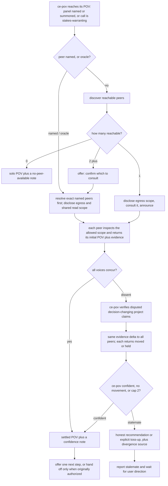
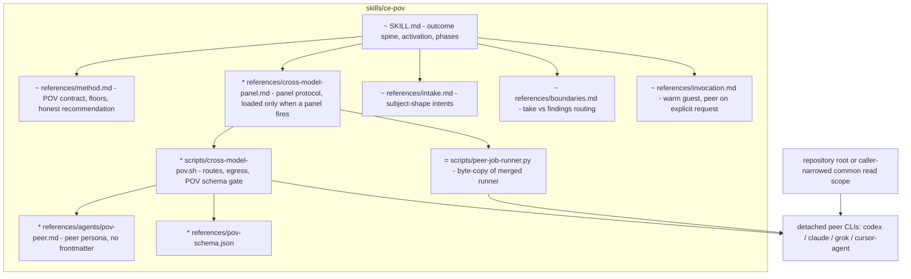

# ce-pov Cross-Model Panel - Plan

## Goal Capsule

- **Objective:** Expand `ce-pov` in two connected ways: generalize its output from an adoption-verdict to a **point of view** (a graded adopt/reject call is one shape; a textured take on a document, an approach set, or a direction is another), and let that point of view be independently checked and debated by one or more different-model peers — without losing any of ce-pov's current single-model behavior.
- **Product authority:** the Product Contract below (user-confirmed through brainstorm, multi-persona review, and planning synthesis). A live user instruction overrides; repo conventions in the project's instruction files govern where this plan is silent.
- **Stop conditions:** surface and stop rather than guess when (a) a change would alter the existing adoption-verdict contract for solo runs (violates R22), (b) byte-parity between duplicated hard-protocol assets cannot hold, or (c) a behavioral eval shows the offer/count or bounded-adaptability protocol failing on either evaluated host and the fix needs a design change rather than prose tightening.
- **Execution profile:** one feature branch, one PR (repo merge policy: all changes via PR). Deterministic guards land in `bun test`; behavioral evidence via skill-creator evals is best-effort local evidence, not CI.
- **Open blockers:** none.

---

## Product Contract

### Summary

ce-pov becomes the "what do we think?" engine: it forms a decisive, project-grounded **point of view** on a subject — an adoption question, a plan document, a set of competing approaches — and, on consequential calls, convenes a cross-model **panel**: different-model peers each independently form their own point of view, then ce-pov (the decision-maker) debates them across bounded rounds to drive genuine convergence. It reports a settled POV when it reaches a confident call; on a real stalemate it recommends where it has a basis to, honestly says "either is viable" where it does not, and always discloses the divergence and its source. The panel is offered, named, or summoned by an `oracle` shorthand; it never fires silently and never blocks a POV.

### Problem Frame

ce-pov's moat is a point of view earned against the project's own context — not generic research. Today it is written as if the only POV shape is an adoption grade (Adopt / Reject / Hold / Trial), which reads the skill's name too literally: users also want its point of view on a plan document ("get Codex and Cursor to review this, reconcile, converge") or on competing approaches ("have three models each take a position, then converge") — textured takes, not yay/nay. And in every shape, the reasoning runs on a single model, so on a high-stakes call a blind spot goes unchallenged exactly where being wrong costs the most. A *different* model, reasoning independently on the same verified facts, can catch it — and where the models still disagree, the disagreement itself is signal. One caveat the design carries honestly: peers can share a *correlated* blind spot, so concurrence raises confidence without guaranteeing independence.

### Key Decisions

- **The output is a point of view, not only an adoption grade** (session-settled: user-directed — corrects an over-literal reading of the existing contract): for adopt/migrate/compare questions the POV is the existing graded verdict, unchanged; for a document or an approach set it is a decisive, textured assessment with a bottom line. Same skill, same grounding discipline, output shape follows the question.
- **ce-pov's contract ends at the converged POV; continuation is a separately authorized handoff, not the deliverable** (session-settled: user-directed — chosen over automatically acting on panel results): ce-pov never mutates while forming or reconciling the POV. An analysis-only request ends with one logical next-step offer and waits; when the original request explicitly authorizes follow-through, ce-pov may hand the verdict to the owning execution skill with inherited scope and authority. Stalemate, scope expansion, destructive work, or insufficient authority returns to the user first.
- **Offer-first, not auto** (session-settled: user-directed — chosen over the review skills' auto-fire): an unnamed request never triggers the panel silently. ce-pov weighs the task's stakes and proactively *offers* the cross-check. This keeps ce-pov an opt-in utility, deliberately unlike ce-doc-review / ce-code-review.
- **ce-pov is the decision-maker; peers carry strong weight** (session-settled: user-directed — chosen over a democratic equal-vote panel): someone must decide, and that is ce-pov. Peers are not token input — ce-pov genuinely reconsiders on their reasoning and evidence and will move when warranted — but it is never mechanically outvoted.
- **Honest recommendation, never forced** (session-settled: user-directed): ce-pov recommends whenever it has a real basis to prefer — the common case — and when options are genuinely viable either way it says so with the pros and cons instead of manufacturing a preference. A neutral no-recommendation scoreboard and a forced pick on a true toss-up are both non-goals.
- **Independent POV by default, skeptic on request** (session-settled: user-directed): each peer forms its own POV to compare; a skeptic-against-the-POV mode is available when asked.
- **Hybrid grounding** (session-settled: user-directed): each peer reasons on ce-pov's verified *project* floor (shared) plus its own *external* check. Because the external checks are independent, divergence can be evidence-rooted, not only judgment-rooted — so the debate carries evidence, not just conclusions (R11, R15).
- **Repository-grounded peers by default** (session-settled: user-directed — chosen over payload-only peers in empty workspaces): after egress disclosure, every peer may independently search and read the repository root under a read-only boundary. A narrower user- or host-supplied filter binds every peer identically and is never broadened; adapters enforce it where possible and disclose cooperative enforcement otherwise.
- **Coordinator-verified reconciliation with explicit movement** (session-settled: user-approved — chosen over free-form position comparison): before each reconcile round, ce-pov verifies disputed, decision-changing project claims and sends the same `verified` / `contradicted` / `unverifiable` evidence delta to every peer. Peers explicitly return `initial`, `moved`, or `held` with the reason, so convergence and no-movement stops are auditable.
- **Bounded, genuine convergence** (session-settled: user-directed): dissent opens a multi-round debate that really tries to converge, stopping on the first of — ce-pov reaches a confident POV, a round moves no voice, or a two-exchange cap. Only a genuine stalemate surfaces to the user.
- **Discovery-driven, count-decides selection** (session-settled: user-directed): a fast reachability check drives selection — one reachable peer runs with a plain announcement, two or more trigger a concrete confirm, zero degrades to solo. Named peers and `oracle` skip the offer.
- **Harnesses, model families, and routes are separate identities** (session-settled: user-directed — chosen over treating Cursor and Composer as synonyms): `Cursor` means the `cursor-agent` harness using its configured default/Auto model; `Composer` means a Composer model reached through Cursor; `Grok` prefers its native CLI and may use a Grok model through Cursor when that intermediary is sanctioned. Attribution reports the requested target, actual harness/intermediary, and verified or unverified serving model separately.
- **Bounded adaptability for a changing model landscape** (session-settled: user-directed — chosen over both frozen adapter IDs and unconstrained improvisation): hard intent, safety, authority, independence, and egress rules never soften. Current route/model mappings are preferred defaults and are attempted first when available. When discovery shows a default is unavailable, obsolete, or incompatible, the agent may choose the closest viable equivalent that preserves those invariants, then discloses the deviation and actual route/model; it never silently changes an explicitly named model or expands recipients.
- **Additive, non-regressive** (session-settled: user-directed): both expansions are conditional extensions of ce-pov's existing outcome. Every current behavior runs unchanged on an adoption question with no peer consulted.
- **Author per the portable-skill field guide, rewriting the skill around a fresh outcome spine if warranted** (session-settled: user-directed): this is a material revision whose *outcome* changed (adoption verdict → point of view), so authoring starts from the spine — result, next consumer, done condition, non-obvious intent — restated for the generalized output, with the activation contract (name/description) recast to route all three subject shapes and the panel triggers. A larger rewrite of `SKILL.md` and `references/method.md` is explicitly in scope over bolting the panel onto the verdict-shaped structure.

### Requirements

**POV subjects and output shape**

- R1. ce-pov accepts three subject shapes and produces a decisive point of view for each: an **external-adoption question** (existing behavior — the graded Adopt/Reject/Hold/Trial verdict, unchanged); a **document** (a holistic take on a plan, spec, or brainstorm — the strengths, the risks, the bottom line); and an **approach set** (competing options the conversation or the user supplies — which one and why, or an honest "either is viable" with the tradeoff).
- R2. Every POV shape keeps ce-pov's grounding discipline: a POV must be earned against verified project facts. The external floor applies in full to external-adoption subjects; for documents and approach sets it applies to whatever external claims are load-bearing in the subject, and the project floor always applies.
- R3. ce-pov remains read-only while forming and reconciling the POV, and its contract ends at the delivered POV plus recommendation. For an analysis-only request it offers one logical continuation and waits. When the original request explicitly authorizes follow-through, it may hand the final verdict to the owning execution skill with inherited scope and authority; stalemate, scope expansion, destructive work, or insufficient authority requires fresh user direction before action.

**Activation and selection**

- R4. A named peer is a **cross-check on ce-pov's own POV, never a substitute for it**: ce-pov always forms its own point of view and consults the named peer(s) to compare. "compare / cross-check with X" is the canonical framing; "check with X" and "also check with X" are synonyms that all resolve to this cross-check behavior. Named peers ("compare with Grok", "cross-check with Codex and Composer", "ask Cursor") are consulted directly, with no confirmation step, honored exactly as given and **uncapped** — naming three peers runs all three. `Cursor` selects the Cursor harness's configured default/Auto model; `Composer` selects a Composer model through Cursor and is not an alias for `Cursor`.
- R5. An `oracle` shorthand (bare `oracle`, or "check with the oracle") fans the request out to reachable different-model peers **up to the 2-peer panel cap**, with no confirmation step. When the same invocation explicitly names peers, the named-peer rule in R4 takes precedence: those exact participants run, uncapped.
- R6. When no peer is named **and no cross-check was explicitly requested**, ce-pov never consults a peer silently and applies the R7 count rule: on a stakes-warranting call (per R18's correction-cost gate) it offers when two or more peers are reachable and announces (no question) when exactly one is; below the stakes threshold it engages nothing. An explicit unnamed request ("get other models' takes") routes per R18's bypass, not this gate.
- R7. Peer selection is driven by a fast reachability discovery (installed CLI, non-host serving family where attestable, egress-allowlisted). Host identity is a tuple of harness plus attested serving family: serving-family exclusion prevents same-model checks, while harness identity prevents Cursor-default from being treated as independent when the host itself is Cursor. Zero reachable → no panel, with a note why; one reachable → consult and announce, no question; two or more → a concrete confirm naming the reachable peers, defaulting to a 2-peer panel (naming which two when more are reachable) and allowing a subset or skip. Cursor-default is eligible when explicitly named or configured as a preference; it is not counted as an automatically discovered different-model voice unless its selected serving family is attestably different from the host. An unverified Cursor-default target cannot occupy an automatic/config-selected panel alongside a model-specific Cursor route such as Composer or Grok-via-Cursor; exact user-named combinations may run, but are disclosed as potentially correlated and never counted as two independent confirmations. Grok remains reachable through sanctioned Cursor when the Grok CLI is absent.
- R8. Named peers use the shared target/route vocabulary from the review skills, but ce-pov resolves and sanctions the concrete model target, harness route, provider, and every intermediary before giving that process project content or repository access. Preferred mappings are attempted first. If preflight discovery or a classified runtime failure shows the preferred mapping is unavailable, obsolete, or incompatible, ce-pov may resolve the closest viable equivalent within the same explicitly requested target/family and reasoning tier. A change of named model, provider, or intermediary is never silent; a new recipient is disclosed and sanctioned before retry. If a dispatched route fails and the next candidate would change the provider or intermediary (for example, Grok via `grok-cli` falling through to `grok-cursor`), the worker returns the failure to the host. A named peer that cannot run without violating these rules is reported, never silently dropped.

**The panel and peer POVs**

- R9. Each consulted peer independently produces its own point of view in the same shape as ce-pov's (a grade for adoption subjects; an assessment with a bottom line for documents and approach sets), using ce-pov's shared verified project floor, its own read-only inspection of the allowed repository scope, and its own external check.
- R10. A peer with no reachable external-research capability degrades to the shared project floor plus its allowed repository inspection and self-reports the missing external check; it is not dropped. On request, a peer runs as a skeptic against ce-pov's POV instead of forming its own — a critique fold-in, not a competing POV, which does not enter the convergence loop.

**Convergence and disclosure**

- R11. When any voice materially dissents (a different grade, or a materially different bottom line on a document or approach set), ce-pov opens a bounded debate. Before each reconcile round, ce-pov verifies the disputed, decision-changing project claims and sends every peer the same bounded evidence delta, classifying each claim as `verified`, `contradicted`, or `unverifiable` with source locations when available. Each voice then reconsiders given that delta plus the other voices' positions, reasoning, **and a succinct summary of the disconfirming evidence each surfaced** — enough context to update on a fact a voice lacked, and enough for ce-pov to later frame the source of the debate for the user, without dumping full research.
- R12. The panel spans ce-pov plus one or more peers. ce-pov is the decision-maker: it strongly weighs every voice but is never mechanically outvoted, and the debate runs across all participating voices, not only pairwise.
- R13. Every peer response carries an explicit movement state: `initial` on first position, `moved` when its decision-relevant position changes with what changed and why, or `held` when it does not with why the new evidence was insufficient. The debate stops on the first of — ce-pov reaches a POV it is confident in after weighing all voices (ideally with the voices aligned); a round returns only `held`; or two reconcile-exchanges have run since the initial dissent. Convergence is ce-pov's confident decision, not a vote tally, so a three-voice, three-position split has a defined outcome (ce-pov weighs, converges, and either decides or surfaces).
- R14. On a confident POV, ce-pov reports it, noting whether the voices aligned. When the voices *concurred*, the confidence note states that concurrence raises but does not eliminate correlated-model error — a unanimous panel is not read as fully independent confirmation.
- R15. On a genuine stalemate (no confident convergence by the stop rule), ce-pov discloses the divergence — ce-pov's current position, each peer's position and movement state, and the *source* of the disagreement, distinguishing a resolvable evidence gap ("the voices differ on facts — Grok found X that Codex did not") from a genuine judgment difference — and applies its honest-recommendation rule: recommend with reasoning when it has a basis to prefer; when the options are genuinely viable either way, say so and lay out the pros and cons instead of forcing a pick. The authorization boundary in R3 governs any continuation.
- R16. Every peer voice's position separately records the user-facing target, actual harness/intermediary route, requested model, model that actually served it (verified where a served-model receipt exists, labeled unverified otherwise), and `independence_verified`. A Cursor-default voice is labeled `Cursor default/Auto; serving model unverified` and sets `independence_verified: false` unless a receipt establishes a serving family different from the host; ce-pov may still weigh an explicitly requested voice but never counts it toward automatic peer counts, cross-model confidence/corroboration, or convergence agreement without that evidence, and never attributes a position to a model that did not run.

**Availability and non-blocking**

- R17. A peer never blocks a POV. A mid-debate peer timeout or failure drops only that voice — the debate continues with the surviving voices — and ce-pov collapses to its own solo POV with a plain "cross-model check unavailable or incomplete" note only when no peer remains. If the identical complete payload cannot fit every participating route, ce-pov never truncates per provider; it treats the panel as incomplete under this same degradation rule. Both surviving-voice results and any dropped voice are reflected in the disclosure, preserving the "always returns a point of view" guarantee.
- R18. The proactive offer is gated on **correction cost, not binary reversibility** — the gate asks how much work will build on this take before a wrong call surfaces, and what correcting it costs then. No offer when the take is informational or a later correction is just an edit; offer when meaningful downstream work will build on it (a plan about to be implemented, an approach choice that gets built) or it feeds a shared, public, security, or data commitment. For adoption subjects this is the existing reversibility tiering read as correction cost (Tier 2/3 offer-eligible, Tier 1 not). **The gate governs only the proactive offer:** an explicit user request for other models' points of view — named or not — bypasses it entirely, on any subject shape. Warm mid-session invocations stay a lightweight guest and consult a peer only on explicit request.

**Cost control and output**

- R19. When ce-pov must infer the question (no explicit prompt), it succinctly confirms the inferred framing with the user before spending on grounding, web research, or peers.
- R20. Every user-facing message — the offer, which-model announcements, the divergence disclosure, and the recommendation — reads in plain, human-friendly language and does not expose the routing, fallback, or job-lifecycle machinery. Egress content-scope (R21) is user privacy information, not machinery, and is surfaced rather than hidden.
- R21. Before any project context egresses or a peer receives repository access, ce-pov discloses in plain language what is being sent or made readable — its verified project-floor grounding, the allowed repository scope, and for document subjects the document itself — which may contain proprietary code and architecture facts, and names the resolved third-party provider plus every intermediary that will actually receive access. It states whether a narrower read filter is adapter-enforced or cooperatively enforced. A route may run only after every actual recipient is egress-allowlisted. `cursor` authorizes Cursor as a recipient/intermediary and is required for Cursor-default; `composer` remains a backward-compatible Cursor authorization for the Composer target; Grok through Cursor requires `grok` plus `cursor` or legacy `composer`; direct Grok requires `grok`. Sanctioning Cursor-default covers Cursor's undisclosed Auto backend only when that unverified serving identity is disclosed; otherwise the route cannot run. A fallback that changes a recipient requires a new disclosure and sanction before retry. External checks may use public subject-level terms only, never repository-derived source fragments, private identifiers, paths, or secrets; where query-content enforcement is cooperative, the disclosure says so.

**Non-regression and authoring**

- R22. All existing ce-pov behavior is preserved unchanged on an external-adoption question with no peer consulted: the two-floor gate, the graded verdict contract, reversibility tiering, cold and warm invocation, the grounding scouts, the follow-up handoff, the optional full write-up, and the compound capture.
- R23. The panel and the POV-shape generalization are authored per `docs/solutions/skill-design/portable-agent-skill-authoring.md`, starting from a restated **outcome spine** (result: a decisive project-grounded POV in the subject's shape; next consumer: the user or calling skill acting on it; done: POV delivered with attribution and disclosure, or an explicit blocker; intent: a POV must be earned, never generic) and a recast **activation contract** covering all three subject shapes, the panel triggers (named / `oracle` / offer), and adjacent negatives (findings review routes to ce-doc-review; option generation routes to ce-ideate/ce-brainstorm). A larger rewrite of `SKILL.md` and `references/method.md` around that spine is in scope when bolting on would blur it. Protocol (subject shapes, activation rules, the stop-rule enum, disclosure fields, degradation branch) stays falsifiable with local quantifiers beside the actions they govern; every route ends in a delivered POV or an explicit blocker; peer CLIs are named as adapters behind the capability ("obtain an independent different-model POV"), with degradation paths per R17. The merged peer-job runner is reused under the repo's byte-duplication plus parity-test convention.
- R24. Deictic subjects such as "the approach," "these options," or "the three options presented" resolve from the active conversation when there is one unambiguous referent. ce-pov asks one focused clarification only when multiple plausible referents would materially change the review. `oracle` signals immediate panel convergence; explicit peer names select the exact participants and take precedence over auto-discovery and the oracle cap.
- R25. By default, every peer receives the repository root as its read-only working scope. A narrower user- or host-supplied filter is normalized once as a repo-relative workspace root plus optional ordered include and exclude path patterns; that same representation is passed identically to every peer and is never broadened. Adapters enforce the workspace root and patterns through read-only sandbox controls where supported; otherwise the prompt states the exact restriction and R21 discloses which part is cooperative. Peers may search and read within scope but may not edit, run mutating commands, or inspect outside it.
- R26. The panel captures one repository-scope identity before initial dispatch (the committed revision plus a digest covering scoped dirty and untracked content) and includes it in every peer payload. ce-pov revalidates that identity before each reconcile dispatch and final fold-in; when it changes, ce-pov does not reconcile stale voices and instead discloses the change and restarts or returns an incomplete panel result.
- R27. Cross-model routing uses **bounded adaptability**. The durable contract is the requested target plus the hard safety, authority, independence, and egress invariants; concrete model IDs, CLI flags, and candidate availability are adapter defaults. The agent inspects current harness capabilities when a default is missing or rejected, prefers the declared mapping first, and may substitute only the closest compatible route/model that preserves the named target and invariants. It records the local fact, chosen substitute, and actual receipt/disclosure. An explicit model request cannot become another model, and any recipient expansion follows R8/R21 rather than being treated as an adapter detail. This principle also governs the duplicated cross-model routing references in ce-doc-review and ce-code-review.

### Key Flows

F1. **Cross-model panel on a point of view.**

- **Trigger:** ce-pov reaches its POV phase and either a panel is named or summoned (any stakes) or the call is stakes-warranting (any subject shape).
- **Resolve subject and participation:** infer an unambiguous conversational subject without restatement; ask once when ambiguous. Explicit names select the exact peers even with `oracle`; bare `oracle` uses its 2-peer cap; otherwise run reachability discovery and the count rule (R4, R5, R7, R24). Normalize the common read scope, capture its repository identity, resolve and allowlist each actual provider/intermediary route, then disclose those recipients and the read boundary before content egresses or access is granted (R8, R21, R25, R26).
- **Consult:** dispatch each participating peer as a detached read-only job rooted at the shared allowed scope; collect each peer's independent POV, `initial` movement state, and disconfirming evidence (R9, R13, R25).
- **Debate:** all voices concur → confident settled POV plus a confidence note (with the correlated-blind-spot caveat, R14), and the flow ends. Any material dissent → ce-pov revalidates the repository identity, verifies decision-changing project claims, sends an identical complete evidence delta to every peer without route-specific truncation, and runs the bounded debate carrying succinct evidence and explicit `moved` / `held` states (R11, R13, R17, R26).
- **Resolve:** ce-pov reaches a confident POV → settled POV (R14); genuine stalemate → honest recommendation (or an explicit "either is viable" with tradeoffs) plus a framed divergence disclosure (R15). A mid-debate peer failure drops that voice and the debate continues (R17).
- **Follow-up:** on an analysis-only request, ce-pov offers one natural continuation and waits. If the original request explicitly authorized follow-through and the result is not stalemated, scope-expanding, destructive, or under-authorized, it hands the verdict to the owning execution skill (R3).
- Throughout: attribute every position to its actual serving model (R16) and render all of it in plain language (R20).

### Visualization

Panel lifecycle for F1 (complements the flow prose; the requirements above stand alone without it):

### Acceptance Examples

- AE1. **Covers R4.** "ce-pov — should we adopt Biome? Check with Codex." → ce-pov forms its OWN verdict and cross-checks it against Codex directly, with no confirm — "check with Codex" is a cross-check, not a hand-off.
- AE2. **Covers R6, R7, R21.** A Tier-3 adopt question, no peer named, two peers reachable → ce-pov offers in plain language and, on accept, discloses that its project grounding will be sent to Codex and Grok before consulting them.
- AE3. **Covers R7.** As AE2 but only one peer reachable → ce-pov consults it and says so, with no question.
- AE4. **Covers R5.** "ce-pov oracle: is it time to drop Webpack for Vite?" → ce-pov fans out to reachable peers up to the 2-peer cap, with no confirmation.
- AE5. **Covers R11, R13, R14.** ce-pov grades Adopt; a peer grades Hold citing a migration cost ce-pov underweighted → ce-pov weighs it, the debate carries the peer's evidence, ce-pov moves to Trial with the peer aligned → confident settled POV reported (ce-pov moving here is convergence working, not a violation of its decision-maker role).
- AE6. **Covers R13, R15.** After two exchanges ce-pov holds Adopt and a peer holds Reject with neither moving → ce-pov reports its recommendation (Adopt, with reasoning) *and* discloses the divergence and whether it is an evidence gap or a judgment difference; it applies no change and hands to the caller.
- AE7. **Covers R1, R3, R11.** "Get Codex and Composer's take on this plan doc, reconcile with yours, and converge." → each voice independently assesses the document, ce-pov debates the material disagreements carrying succinct evidence, delivers the converged take, and *offers* to apply the changes it implies — the edits happen as follow-up work, not inside the POV.
- AE8. **Covers R1, R15.** Three approaches to a design problem are on the table; ce-pov and two peers each independently take a position → two voices back approach A for simplicity, one backs B for extensibility, and after the debate ce-pov judges both genuinely viable → it says exactly that, lays out the tradeoff, and recommends nothing rather than manufacturing a preference.
- AE9. **Covers R17.** A three-voice panel mid-debate where one peer times out → the debate continues with ce-pov and the surviving peer; only if the last peer also fails does ce-pov fall back to its solo POV with an "incomplete cross-model check" note.
- AE10. **Covers R19.** A bare link with no stated question, on a stakes-warranting subject → ce-pov confirms the inferred framing in one line before fanning out to peers or web research.
- AE11. **Covers R4, R18.** A Tier-1 (low correction-cost) question where the user says "get Grok's and Codex's take too" → the stakes gate is bypassed because the request is explicit; both named peers run.
- AE12. **Covers R5, R24.** "/ce-pov oracle with codex and composer on the approach" after one approach has been discussed → ce-pov resolves that conversational subject without asking for a restatement and runs exactly Codex and Composer; the explicit names override oracle auto-discovery.
- AE13. **Covers R24.** "/ce-pov oracle with codex and composer on the three options presented" when exactly three options are present in the active conversation → the options become the subject without a clarification; when two different three-option sets are plausible, ce-pov asks one focused question before spending.
- AE14. **Covers R21, R25.** The user restricts a panel to `skills/ce-pov/` → every peer receives that same declared read boundary and is instructed not to inspect outside it; adapters enforce it where supported, otherwise ce-pov discloses before dispatch that the restriction is cooperative and the route may technically retain broader read capability.
- AE15. **Covers R11, R13.** Codex and Composer dispute whether a project invariant exists → ce-pov verifies the claim, sends both peers the same classified evidence delta with source locations, Codex returns `moved` and Composer returns `held` with reasons, and the next stop decision uses those explicit states rather than comparing prose.
- AE16. **Covers R3.** "Get the panel's recommendation" → ce-pov returns the POV and offers one logical next step; it makes no edit and waits.
- AE17. **Covers R3.** "Get the panel's recommendation, then implement the winner" → ce-pov completes and reports the POV first, then hands a non-stalemated in-scope verdict to the owning execution skill under the original authority; a stalemate or scope expansion returns to the user instead.
- AE18. **Covers R4, R7, R16.** "Get Cursor's take" → ce-pov runs `cursor-agent` with its configured default/Auto model, not a forced Composer model, and labels the serving model unverified unless a receipt identifies it. "Get Composer's take" instead selects the current compatible Composer model through Cursor. Cursor-default is not silently counted as different-model corroboration when its serving family cannot be attested.
- AE19. **Covers R8, R21, R27.** A declared adapter-default model ID is no longer accepted by the installed CLI → the agent discovers the current compatible model in the same requested family/tier, records and discloses the substitution, and proceeds. An explicit user-specified model ID is not substitutable: if that exact model cannot run, it returns unavailable. If only a different model family or a newly receiving intermediary is available, it does not improvise silently: it returns unavailable or obtains the required new sanction.

### Scope Boundaries

- **ce-pov gives the take; ce-doc-review finds and fixes the defects.** A document POV is a holistic, decisive assessment ("here's what we think of this plan and the bottom line"), not a structured multi-persona findings review with per-finding walk-throughs — that remains `ce-doc-review`.
- The panel weighs in on the **point of view only**, not on ce-pov's grounding scouts. Peers may independently inspect the common allowed repository scope, but ce-pov owns the verified project floor and the classified evidence deltas used in reconciliation.
- ce-pov does not generate the approach sets it judges — options come from the conversation, the user, or a generation skill (`ce-ideate`, `ce-brainstorm`); ce-pov takes a position on them. A "ground it like ce-pov, but let a named peer render the POV alone" **delegate mode** is also out of scope — a named peer is a cross-check (R4), not a replacement.
- Reuses the merged detached-peer infrastructure and its target set (codex / claude / grok / cursor / composer): Cursor is the harness-default target, while Composer and Grok may use Cursor as an intermediary. No new runner lifecycle is designed; ce-pov receives the required byte-identical runner copy and a POV-specific worker adapter, and recipient-changing fallback selection moves to the host-side sanction boundary.
- New harnesses or models beyond that set (for example, CoPilot) are a later addition, out of scope now.
- ce-pov does **not** adopt the review skills' auto-fire posture; the panel is offer-first by design.
- ce-pov's position may move through the bounded debate (convergence), but it is never mechanically outvoted and never mutates while forming or reconciling the POV. Continuations obey the original-request authority and fresh-authority gates in R3.

### Dependencies / Assumptions

- Depends on the detached peer-job infrastructure merged for ce-doc-review / ce-code-review (runner lifecycle, host attestation, candidate walk with cross-provider fallback, model-identity receipts, quota/skip legibility). The runner is domain-agnostic (runs an arbitrary worker and publishes a caller-declared artifact), so a POV-shaped return needs no new lifecycle machinery; the findings-coupled `cross-model-*.sh` orchestration layer needs a POV-shaped sibling (U3).
- Assumes the peer contract generalizes from the review skills' findings-shaped return to a POV-shaped return (position, reasoning, succinct evidence, external-check note) without new lifecycle machinery — verified at planning time against the merged runner (it runs an arbitrary argv and publishes a caller-declared result path).

---

## Planning Contract

**Product Contract preservation:** changed R3/R15 to distinguish ce-pov's read-only POV contract from an explicitly pre-authorized downstream handoff; expanded R4/R5/R7-R9/R11/R13/R16/R17/R21, added R24-R27, and added AE12-AE19 for intent-aware shorthand, pre-sanctioned actual routes, repository-root read access with uniform narrowing, snapshot-consistent rounds, coordinator-verified evidence deltas, explicit movement states, the Cursor-harness/Composer-model distinction, and bounded adaptability. The user-facing behavior is session-settled; the route-sanction, payload, repository-identity, and routing-identity clauses close implementation contradictions discovered during plan review. The earlier oracle/offer cap, correction-cost gate, and all other Product Contract text remain preserved.

### Key Technical Decisions

- **Panel cap: at most 2 peers when ce-pov selects; named peers uncapped** (session-settled: user-directed — chosen over "all reachable"): `oracle` and the proactive offer clamp to 2 (matching the review skills' `CROSS_MODEL_MAX_PEERS` posture); an explicit list of named peers is honored exactly, however many. The confirm prompt picks which 2 when 3+ are reachable.
- **Stakes gate = correction cost, governing only the proactive offer** (session-settled: user-directed — chosen over binary reversibility, which under-fires in software where almost everything is technically reversible): the gate asks how much work builds on the take before a wrong call surfaces and what correction costs then; explicit requests bypass it entirely. Adoption subjects keep the existing tier machinery, read as correction cost.
- **Byte-duplication with parity tests for every shared asset** (session-settled: user-approved — surfaced in the planning synthesis; forced by the repo's skill self-containment rule, which forbids cross-skill imports): `peer-job-runner.py` byte-identical across ce-doc-review / ce-code-review / ce-pov (extend `tests/peer-job-runner-parity.test.ts`); the model-receipt shell kernel byte-identical across the three worker scripts (extend `tests/cross-model-receipt-parity.test.ts`).
- **`oracle` is the fan-out keyword** (session-settled: user-directed — user-proposed; no better candidate surfaced).
- **Intent-aware shorthand resolves the subject; explicit names win participant resolution** (session-settled: user-directed — chosen over requiring a fully restated standalone brief): deictic phrases resolve from the active conversation when unambiguous and ask once only when competing referents would change the review. `oracle` requests immediate convergence; names on the same invocation select the exact peers and override the oracle cap and auto-discovery.
- **Repository-root read-only is the default peer workspace** (session-settled: user-directed — chosen over payload-only peers in empty scratch workspaces): each route starts at the repository root under the strongest available read-only controls. A caller restriction narrows every peer identically; adapters use workspace/sandbox boundaries where expressible and otherwise rely on an explicit prompt restriction plus truthful cooperative-enforcement disclosure. Scratch remains only for transient prompt/result artifacts.
- **One canonical read-scope representation feeds every adapter:** normalize the allowed scope once as a repo-relative workspace root plus optional ordered include/exclude patterns. The identical value enters each peer prompt, disclosure, and route adapter; unsupported pattern enforcement is explicitly cooperative rather than silently dropped.
- **Resolve the actual route before egress:** availability probing may enumerate candidates, but the host sanctions one concrete provider/intermediary route before it receives project content or repository access. A runtime failure returns control to the host; a fallback with a different recipient is a newly disclosed dispatch, not an automatic worker-internal hop. The egress allowlist covers every provider and intermediary, including Cursor on `grok-cursor`.
- **Separate target, harness, provider, and served model:** `cursor` is a harness-default target whose adapter omits `--model` (Cursor Auto/default); `composer` is a model-family target routed through `cursor-agent`; `grok` prefers `grok-cli` and may route a Grok model through Cursor. Selection and receipts carry these identities separately instead of treating CLI brand as provider identity.
- **Bounded adaptability is a shared routing principle** (session-settled: user-directed — chosen over frozen IDs or unconstrained fallback): preferred adapter mappings run first. On observed capability drift, the agent may discover and select the closest same-target/same-family equivalent while preserving safety, authority, independence, and egress invariants. Explicit model requests and new recipients never change silently. The principle and target vocabulary are added at the owning shared-reference layer in ce-pov, ce-doc-review, and ce-code-review; deterministic adapters accept the resolved concrete choice and continue to enforce hard boundaries.
- **POV worker script is an adapted sibling, not a reuse, of the review workers:** `cross-model-adversarial-review.sh` is findings-coupled (hardcodes the findings schema, validates `.findings|type=="array"`, composes from the adversarial persona). U3 creates `skills/ce-pov/scripts/cross-model-pov.sh` with the same egress allowlist, `set -m` group lifecycle, heartbeat, skip-evidence, and receipt kernel — but a POV-shaped schema gate, a POV persona, repository-grounded read-only route adapters, and a caller-declared common read scope. Route-specific controls may differ from the review workers only where repository reading requires it, and those deltas are pinned by route tests.
- **Coordinator verification precedes every reconcile round** (session-settled: user-approved — chosen over peers exchanging unverified assertions): ce-pov identifies disputed claims that could change the decision, verifies them against the allowed repository scope, and sends every peer the same bounded `verified` / `contradicted` / `unverifiable` delta with source locations. Workers still run with no session persistence, so each debate round re-dispatches with the full original subject plus the common evidence delta and the other voices' positions, reasoning, and up to ~5 evidence bullets per voice.
- **All rounds bind to one repository-scope identity:** the initial payload records the committed revision plus a digest of scoped dirty and untracked content. Revalidate before reconcile and final fold-in; never compare or converge voices formed against different repository states.
- **Peer POV schema makes movement explicit** (session-settled: user-approved — chosen over inferring movement from prose): one JSON object carries voice identity, `position`, `reasoning`, attributed `evidence`, `external_check`, `mode`, and `movement` (`initial`, `moved`, or `held`; reconcile responses explain what changed or why new evidence was insufficient), plus the receipt fields `cross_model_route` / `model_requested` / `model_actual` / `independence_verified`. `blocked` remains a valid position when the peer cannot ground.
- **POV delivery and downstream mutation have separate authority gates** (session-settled: user-directed — chosen over either always stopping or automatically applying results): ce-pov never mutates during POV formation or reconciliation. Analysis-only requests end with one next-step offer; an original request that explicitly authorized follow-through may hand the verdict to the owning execution skill, except stalemate, scope expansion, destructive action, or insufficient authority always returns to the user.
- **Subject shapes extend the existing intake intents, not a new gate:** `references/intake.md` gains Document-take and Approach-set intents beside Adopt/Migrate/Compare/Exposure/Explainer, and the frame gate's existing propose-never-guess behavior plus R19's confirm-before-spend cover the inferred-question case.
- **Routing line for document subjects** (Product Contract Scope Boundaries, instantiated in `references/boundaries.md`): "what do you think of this doc" → ce-pov holistic take; "review this doc / find the issues" → route to `ce-doc-review`; when ambiguous, one clarifying line, not a guess.
- **Tier-2-equivalents stay offer-eligible:** the correction-cost gate naturally includes bounded-but-real correction cost; the offer is one line and declining is free, so gating tighter would under-serve the blind-spot goal.

### High-Level Technical Design

Asset topology — what gets created (`*`) vs. edited (`~`) vs. byte-copied (`=`), and how the pieces talk at runtime:

Runtime sequence (per F1): orchestrator resolves the conversational subject, exact participants, normalized common read scope, repository-scope identity, and one actual sanctioned route per peer → discloses each actual recipient plus the common read boundary → composes the common peer payload (framed question + project-floor summary + document/approach content per subject shape + `pov-schema.json`) and verifies it fits every route without truncation → `start`s one repository-grounded read-only runner job per peer → polls with bounded `wait` while continuing its own POV → folds initial peer POVs in only if the repository identity still matches → on dissent, verifies decision-changing project claims and composes one common classified evidence delta → revalidates identity and re-dispatches the complete subject plus that delta and all positions for explicit `moved` / `held` responses up to the 2-exchange cap → decides, discloses, then offers or performs only the continuation the original request authorized.

Sequencing: U1 and U3 have no interdependency and can proceed in parallel; U2 follows U1; U4 needs U1 and U3; U8 follows U3 because it extends the shared route vocabulary across the review skills; U5 needs U1–U4 and U8; U6 needs U1–U4 and U8; U7 (evals) runs last against the assembled skills.

---

## Implementation Units

### U1. Generalize the contract: outcome spine in SKILL.md and the POV contract in method.md

- **Goal:** ce-pov's always-loaded prose states the generalized outcome (a decisive project-grounded POV in the subject's shape) and `method.md` defines the POV contract for all three subject shapes, with the adoption verdict contract preserved verbatim in behavior.
- **Requirements:** R1, R2, R3, R15 (honest recommendation), R22, R23.
- **Dependencies:** none.
- **Files:** `skills/ce-pov/SKILL.md`, `skills/ce-pov/references/method.md`.
- **Approach:** Rewrite `SKILL.md` from the outcome spine per the field guide: result, next consumer, done condition, intent first; recast the frontmatter `description` to route all three subject shapes plus the panel triggers and name the adjacent negatives (findings review → ce-doc-review, option generation → ce-ideate/ce-brainstorm); keep the phase structure (Frame → Ground → Verify → POV → Follow-up) and the Model Tiers section. In `method.md`: keep the four steps, the two-floor gate, and the grade vocabulary untouched for adoption subjects; add the two new POV shapes (document take, approach-set position) with their output contracts (bottom line + strengths/risks for documents; chosen option or honest toss-up with tradeoffs for approach sets); scope the external floor per R2 (full for adoption; load-bearing-external-claims only for documents/approach sets, project floor always); add the honest-recommendation rule and R3's authority-sensitive continuation boundary — POV formation/reconciliation never mutates, analysis-only offers one next step and waits, explicitly pre-authorized follow-through hands off only after a non-stalemated in-scope verdict; define shape-neutral gate-failure returns for the new subjects — "Blocked — insufficient project grounding" / "Blocked — external evidence unavailable" (the R23 explicit-blocker shape) with the same numbered what-to-inspect list, keeping the two Hold subtypes untouched for adoption subjects. The rewrite preserves in behavior the Phase 1 repo-profile-cache protocol (the SKILL_DIR anchor block, get/HIT/MISS/NO-CACHE/put flow, cache-scoped scout dispatch) alongside the phases and Model Tiers.
- **Patterns to follow:** the outcome-spine ordering and prose-admission rules in `docs/solutions/skill-design/portable-agent-skill-authoring.md`; the existing method.md's plain-language grade rendering ("render the grade so the reader never has to decode it") extends to all POV shapes.
- **Test scenarios:** deterministic guards land in U5 (greppable: the three subject shapes named in SKILL.md; method.md carries the honest-recommendation rule, the unchanged grade vocabulary, and the Blocked gate-failure returns; SKILL.md still invokes `scripts/repo-profile-cache.py`). Behavioral: U7 evals cover non-regression (adoption verdict unchanged solo) and subject-shape routing.
- **Verification:** the adoption-verdict contract text (grade vocabulary, two-floor gate, schema fields) survives verbatim or stronger; a reader can trace each of R1's three shapes to an explicit output contract in method.md.

### U2. Intake, boundaries, and invocation updates for subject shapes

- **Goal:** the frame gate recognizes document and approach-set subjects, the routing table separates a take from a findings review, and warm invocations gain peer-on-explicit-request.
- **Requirements:** R1, R18 (warm guest), R19, R4 (cross-check framing), R24.
- **Dependencies:** U1.
- **Files:** `skills/ce-pov/references/intake.md`, `skills/ce-pov/references/boundaries.md`, `skills/ce-pov/references/invocation.md`.
- **Approach:** `intake.md`: add **Document-take** and **Approach-set** intents to the Step 2 list, each with a one-line discriminator; extend Step 1 orientation ("a document path → read its headings; an approach set → identify the options on the table"); resolve deictic subjects from the active conversation when exactly one referent fits and ask one focused clarification only when competing referents would materially change the review. `boundaries.md`: add the take-vs-findings routing row ("review this doc / find the issues" → `ce-doc-review`; "what do you think of this doc" → ce-pov) and an approach-set row (options supplied → ce-pov judges; options to invent → `ce-ideate`). `invocation.md`: add the warm guest's peer-on-explicit-request rule and the shorthand contract: `oracle` requests immediate convergence, while explicit names on the same invocation select exact participants and take precedence over auto-discovery and the oracle cap.
- **Patterns to follow:** the existing routing-table shape in `boundaries.md`; intake's existing intent-list voice.
- **Test scenarios:** U5 pins the routing tokens (boundaries.md names `ce-doc-review` on the findings row; intake.md lists the two new intents). Behavioral: U7 evals include one adjacent-negative activation case ("review this doc" routes away).
- **Verification:** the frame gate proposes sensible framings for a bare document path; the boundaries table answers take-vs-findings without ambiguity.

### U3. Panel execution assets: runner byte-copy, POV worker script, schema, peer persona

- **Goal:** ce-pov can dispatch detached, read-only, egress-disclosed peer POV jobs with the same lifecycle guarantees as the review skills.
- **Requirements:** R8, R9, R10, R13, R16, R17, R21 (mechanics), R23 (adapters), R25-R27.
- **Dependencies:** none (parallel with U1).
- **Files:** `skills/ce-pov/scripts/peer-job-runner.py` (byte-copy), `skills/ce-pov/scripts/cross-model-pov.sh` (new), `skills/ce-pov/references/pov-schema.json` (new), `skills/ce-pov/references/agents/pov-peer.md` (new), `tests/peer-job-runner-parity.test.ts`, `tests/cross-model-receipt-parity.test.ts`.
- **Approach:** Copy `peer-job-runner.py` byte-identically from the review skills and add ce-pov to the runner parity test. Author `cross-model-pov.sh` as an adapted sibling of `cross-model-doc-review.sh`: preserve the candidate probing, `set -m` provider-group lifecycle with completion-path group reap, heartbeat, peer-skip-evidence, and byte-identical receipt kernel, but split route resolution from dispatch. The host resolves one egress-allowlisted target/provider/intermediary route and concrete model choice before passing content or access; the worker runs that fixed route and returns failure instead of automatically hopping to a new recipient. Add a `cursor` fixed route that uses `cursor-agent` without `--model` so Cursor owns its default/Auto choice; keep `composer` as a distinct route with an explicit compatible Composer model and keep Grok's native-then-Cursor candidate semantics at host resolution. Allow the host to pass a discovered concrete same-family model override when a preferred ID is rejected, while defaulting to the declared mapping first. Each route starts at the normalized repository/read root under its strongest available read-only controls; identical include/exclude patterns enter every prompt and adapter, with unsupported enforcement marked cooperative. Keep private scratch separate from the repository for payloads, raw output, logs, and results. The usable-output gate requires string-typed non-empty `position` and `reasoning` plus a valid `movement` enum. `pov-peer.md` restricts external checks to public subject-level terms and tells the peer to inspect only the allowed scope, make no mutations, and explain `moved` or `held` against the common evidence delta.
- **Patterns to follow:** `skills/ce-doc-review/scripts/cross-model-doc-review.sh` (copy lifecycle, candidate probing/classification, receipt, and route structure; keep recipient-changing fallback selection host-side and adapt provider flags only for the repository-grounded read boundary specified here); `skills/ce-doc-review/references/findings-schema.json` (schema conventions); the persona-brief voice in `skills/ce-doc-review/references/personas/`.
- **Execution note:** copy lifecycle and receipt blocks from the doc-review worker rather than re-deriving them. Route deltas are deliberate: repository reading is enabled without write or mutating-exec authority, and per-route external search remains bounded (grok: drop `--disable-web-search`; claude: allow read/search/fetch tools but not write/edit tools; codex/cursor-agent: use read-only sandbox/workspace posture and degrade external checks per R10 where network is denied). Pin every route's actual enforcement and disclosure posture rather than claiming controls a CLI does not expose.
- **Test scenarios:** (mirroring `tests/skills/ce-doc-review-cross-model-routes.test.ts` in `tests/skills/ce-pov-cross-model-routes.test.ts`) every fixed route starts at the declared repository/read root with read-only / least-privilege flags and no mutation capability; the same normalized narrowed scope reaches every peer; route-specific workspace/pattern enforcement is asserted where supported and cooperative enforcement is surfaced otherwise; the allowlist matrix requires `cursor` for Cursor-default, `composer` for Composer-via-Cursor, `grok` plus `cursor` or legacy `composer` for Grok-via-Cursor, and `grok` for direct Grok; a failed fixed route returns to the host rather than silently switching recipients; `cursor` emits no `--model` flag and records requested target `auto`, served model `unverified`, and `independence_verified: false`, while `composer` explicitly requests the preferred Composer model; a discovered same-family override supersedes only the model ID, not the target, route, or recipients; codex/claude/grok/composer retain their bounded web-enablement delta without repository-derived search terms; invalid or absent `movement`, missing/empty `position`, or missing/empty `reasoning` is no usable output; quota errors yield `peer skip evidence`; private scratch stays outside the repository; runner and receipt-kernel parity still hold.
- **Verification:** route suite green; both parity suites green with the third copies added; best-effort live capability smokes cover each reachable distinct adapter class (Codex, Claude, Grok CLI, cursor-agent), reading an allowed canary, attempting and failing a mutation canary where the adapter claims enforcement, reporting cooperative versus adapter enforcement, and producing a schema-valid movement/receipt artifact. At least one real-peer smoke is required; an unavailable adapter is reported rather than simulated.

### U4. Panel protocol reference and SKILL.md wiring

- **Goal:** the orchestrator-facing panel protocol exists as a conditional reference, and SKILL.md loads it exactly when a panel can fire.
- **Requirements:** R3–R8, R11–R17, R20, R21, R24–R27 (protocol), R23 (extraction + falsifiable protocol).
- **Dependencies:** U1, U3.
- **Files:** `skills/ce-pov/references/cross-model-panel.md` (new), `skills/ce-pov/SKILL.md` (load pointer).
- **Approach:** Author the panel protocol with the field guide's protocol discipline — every rule falsifiable, local quantifiers beside the actions: conversational subject resolution; participation precedence; Cursor-harness versus Composer-model identity; preferred-first bounded adaptability; normalized common read scope; repository-scope identity capture/revalidation; pre-egress resolution, allowlisting, and disclosure of each actual target/provider/intermediary route; dispatch/poll/reap via the runner; fold-in with receipt attribution; material-dissent detection; coordinator verification of only disputed, decision-changing project claims into one bounded `verified` / `contradicted` / `unverifiable` evidence delta with source locations; identical complete delivery without per-provider truncation; required `initial` / `moved` / `held` states and `confident` / `no-movement` / `cap-2` stops; degradation branches; skeptic mode; and private scratch cleanup on success, failure, timeout, interruption, and reap. The R3 continuation gate is a conjunction: the original prompt explicitly authorizes the named downstream action, the final result is non-stalemated, the action stays within inherited scope, and the action is non-destructive and otherwise authorized. All four must pass for handoff; otherwise offer one next step and wait. SKILL.md gets a 2-3 line conditional pointer, not an inline summary.
- **Patterns to follow:** `skills/ce-doc-review/references/cross-model-review.md` (host attestation, candidate ordering, announce/disclose rules, fold-in and skip-classification discipline — adapt, don't copy: the panel is offer-first and debate-bearing where the review pass is auto and additive).
- **Test scenarios:** U5 pins the stop-rule and movement enums, named-over-oracle precedence, repository-root default, normalized uniform narrowed scope, cooperative-enforcement disclosure, pre-sanctioned actual-route rule, repository-identity revalidation, no-truncation degradation, material-dissent criterion, common classified evidence delta, four-part handoff conjunction, and reconcile egress scope. Behavioral: U7 covers the shorthand, restriction, movement, and authority branches.
- **Verification:** the reference reads as a complete protocol without SKILL.md context (a fresh subagent could follow it); no load-bearing rule exists only in SKILL.md prose.

### U5. Deterministic guards in bun test

- **Goal:** every greppable invariant this plan introduces is pinned mechanically so drift fails CI.
- **Requirements:** R23–R27 (falsifiable protocol, read boundary, repository identity, and bounded adaptability), plus the specific tokens from U1–U4 and U8.
- **Dependencies:** U1, U2, U3, U4, U8.
- **Files:** `tests/skills/ce-pov-cross-model-routes.test.ts` (new; the U3 scenarios), `tests/peer-job-runner-parity.test.ts`, `tests/cross-model-receipt-parity.test.ts`, `tests/review-skill-contract.test.ts` or a new `tests/pov-skill-contract.test.ts` (agent's call at implementation — group ce-pov guards where they read best).
- **Approach:** Implement the U3 route suite; extend both parity suites to three copies; add contract guards pinning the smallest falsifiable units: three subject shapes; deictic resolution and named-over-oracle precedence; Cursor-default versus Composer-specific semantics; preferred-first bounded adaptability with same-target substitution and no silent named-model/new-recipient change; repository-root default plus identical normalized narrowing; truthful cooperative-enforcement disclosure; allowlisting and disclosure of every actual provider/intermediary before access; no automatic new-recipient fallback; repository-identity revalidation before reconcile/fold-in; no per-provider payload truncation; stop-rule and movement enums; common classified coordinator evidence delta; the four-part downstream handoff conjunction; take-vs-findings routing; non-empty `position`/`reasoning` plus valid `movement`; honest-recommendation and Blocked returns; material dissent; and the repo-profile-cache invocation. Add lifecycle tests proving private scratch is outside the repo and cleaned after every terminal path. Extend the review route/parity suites with `cursor` candidate/adapter tests and a preferred-model override case. No whole-body snapshots.
- **Patterns to follow:** `tests/review-skill-contract.test.ts` (producer/consumer token pinning); `tests/skills/ce-doc-review-cross-model-routes.test.ts` (sandbox construction, interpreter-shim resolution — reuse its `resolveInterpreter` approach).
- **Test scenarios:** the guards *are* the scenarios; each new test fails when its pinned token is removed from the source file (spot-verify by temporary mutation for the route-gate and one parity case, as the #1135 tests did).
- **Verification:** full `bun test` green; each new guard demonstrated to fail on the regressing edit at least once during development.

### U6. Documentation sync

- **Goal:** the plugin's user-facing docs describe the expanded ce-pov.
- **Requirements:** R3, R4, R7, R8, R16, R21, R22, R24, R25, R27, AE18, AE19, repo plugin-maintenance convention.
- **Dependencies:** U1–U4, U8.
- **Files:** `docs/skills/ce-pov.md`, `docs/skills/ce-doc-review.md`, `docs/skills/ce-code-review.md`, `docs/skills/README.md` (catalog row), `README.md` (inventory row).
- **Approach:** Update the ce-pov docs page: purpose; three subject shapes; offer-first, named, and oracle panels; the two short conversational shorthand examples; Cursor-default versus Composer-specific naming; bounded adaptability; repository-root read-only default and narrowed-filter disclosure; coordinator verification and movement reporting; honest recommendation; and the analysis-only versus pre-authorized handoff boundary. Add a concise route-selection note to the doc-review and code-review pages: declared mappings are preferred first, current compatible equivalents may be discovered within the same target/invariants, and Cursor means harness default while Composer means the model through Cursor. Keep when-to-use versus ce-doc-review and chain position unchanged. Update both inventory rows without hand-bumping versions or counts.
- **Test expectation:** none — documentation-only unit; `bun run release:validate` confirms metadata consistency.
- **Verification:** `release:validate` and `plugin:validate` green; the ce-pov page matches the shipped SKILL.md description and both review pages match U8's shipped target/adaptability behavior.

### U7. Behavioral evals via skill-creator (Claude and Codex)

- **Goal:** the judgment-layer behavior — offer restraint, count rule, conversational shorthand, shared read scope, verified reconciliation, authority-sensitive handoff, subject-shape routing, and non-regression — is evidenced on both default hosts before ship.
- **Requirements:** R1, R3–R8, R11, R13, R15–R18, R21, R22, R24–R27; the cross-host eval default.
- **Dependencies:** U1–U4, U8 (assembled skills).
- **Files:** none in-repo (eval evidence recorded in the PR body per repo convention).
- **Approach:** Use the skill-creator eval workflow with this nineteen-case fixture pack: (1) a plain adoption question with no peer mention runs the classic verdict, and a warm mid-session invocation stays a guest (R22); (2) a low-correction-cost question gets no proactive offer (R18); (3) the 2+/1/0 reachable-peer branches offer a named 2-peer default, consult-and-announce one, or return a solo POV with the no-peer note (AE2, AE3, R17); (4) "get Grok's take too" on a trivial question bypasses the stakes gate (AE11); (5) "review this doc" routes toward ce-doc-review; (6) three named peers are all honored (R4); (7) bare `oracle` fans out to at most two peers without confirmation (AE4); (8) a plan-document panel produces a converged take and offers continuation (AE7); (9) evidence-backed dissent moves ce-pov with the voices aligned (AE5); (10) dissent survives two exchanges and returns a reasoned recommendation plus evidence-gap-versus-judgment disclosure (AE6); (11) `/ce-pov oracle with codex and composer on the approach` resolves one conversational referent and exact participants (AE12); (12) `on the three options presented` resolves without restatement (AE13); (13) competing referents trigger one focused clarification before spend (R24); (14) a caller restriction reaches all peers identically with truthful enforcement disclosure (AE14); (15) a disputed project claim produces the same classified coordinator delta and both `moved` and `held` responses (AE15); (16) analysis-only returns a next-step offer without mutation (AE16); (17) explicitly authorized implementation hands a non-stalemated in-scope verdict downstream, while stalemate or scope expansion pauses (AE17); (18) named `Cursor` selects the harness default/Auto route and is not rewritten to Composer, while named `Composer` selects a Composer model through Cursor (AE18); (19) an obsolete preferred model produces capability discovery and a same-target/same-family substitution with disclosure, while an only-different-family or new-recipient alternative pauses (AE19). Run all cases on Claude Code and Codex per the cross-host default.
- **Execution note:** evals are best-effort local evidence, not CI — findings route back into prose fixes at the owning layer per the repo's applying-feedback rules, with one line per item in the PR body.
- **Test scenarios:** the nineteen cases and their R/AE mappings are enumerated in the Approach above; each case must produce its mapped behavior on both hosts.
- **Verification:** each eval case produces the AE-expected behavior on both hosts, or its failure is fixed and re-run; results summarized in the PR body.

### U8. Shared review routing: Cursor-default target and bounded adaptability

- **Goal:** ce-doc-review and ce-code-review use the same durable target vocabulary and bounded-adaptability principle as ce-pov without changing their review outcomes or auto-fire posture.
- **Requirements:** R4, R7, R8, R16, R21, R27, AE18, AE19.
- **Dependencies:** U3.
- **Files:** `skills/ce-doc-review/references/cross-model-review.md`, `skills/ce-code-review/references/cross-model-review.md`, `skills/ce-doc-review/scripts/cross-model-doc-review.sh`, `skills/ce-code-review/scripts/cross-model-adversarial-review.sh`, `tests/skills/ce-doc-review-cross-model-routes.test.ts`, `tests/skills/ce-code-review-cross-model-routes.test.ts`, `tests/cross-model-receipt-parity.test.ts`.
- **Approach:** At the shared routing-reference layer, separate requested target, serving model/provider, and harness/intermediary. Accept conversation/config preference `cursor` as Cursor's default/Auto model and keep `composer` model-specific. Preserve `grok`'s native CLI preference and sanctioned Grok-via-Cursor option. State the bounded-adaptability rule once in each byte-equivalent reference block: preferred mappings first; inspect current CLI/model capabilities only after an unavailable/obsolete/incompatible observation; choose the closest same-target/same-family equivalent; preserve review scope, read-only controls, host exclusion, and egress allowlists; disclose actual route/model; never silently change an explicit model or recipient. Add a `cursor` adapter that omits `--model`, records `model_requested: auto` and `model_actual: unverified` absent a receipt, and accepts a caller-resolved model override for model-specific routes. Split discovery from dispatch in both review skills: the host sanctions one fixed route before content egress; a route failure returns to the host, and any recipient-changing retry requires a new disclosure/sanction. Keep the review skills' additive/non-blocking outcome and auto-fire posture; this unit does not import ce-pov's offer/debate protocol.
- **Patterns to follow:** the existing byte-parity blocks across both review references/scripts; `tests/skills/ce-code-review-cross-model-routes.test.ts` provider-kernel parity cases; local `cursor-agent --help` / `cursor-agent models` capability output as execution-time evidence, not permanent IDs in the Product Contract.
- **Execution note:** begin with failing route tests proving that `cursor` is currently ignored and that the adapter has no default-model route. Implement the smallest shared-kernel extension, then run the existing Grok/Composer and fallback suites to prove no semantic regression.
- **Test scenarios:** `cursor` preference resolves when `cursor-agent` is installed; the cursor adapter has no `--model` flag; Composer still has an explicit model; a same-family override changes only the target-bound requested model argument and cannot leak to another route; unknown or cross-family substitution is rejected by the host protocol; Grok still prefers `grok-cli` and uses Cursor only when sanctioned; the backward-compatible allowlist matrix is enforced; Cursor-default records `independence_verified: false` absent a different-family receipt and cannot trigger cross-model agreement promotion; auto/config selection never pairs unverified Cursor-default with another model-specific Cursor route, while exact named pairing is disclosed as potentially correlated; host harness plus serving-family exclusion still applies; route/model receipts distinguish Cursor-default, Composer-via-Cursor, and Grok-via-Cursor; doc/code shared blocks remain byte-identical where parity is promised.
- **Verification:** both focused route suites and receipt parity pass; one Cursor-default dry-run and one obsolete-model decision fixture demonstrate the intended behavior.

---

## Verification Contract

| Gate | Command / method | Proves |
|---|---|---|
| Full test suite | `bun test` | Pre-sanctioned actual routes, Cursor-default/Composer-specific semantics, preferred-first bounded adaptability, repository-grounded read-only safety, normalized uniform narrowing, snapshot-consistent rounds, no-truncation degradation, scratch cleanup, movement/schema gates, three-way byte-parity, contract guards, and no regression |
| Release metadata | `bun run release:validate` | Skill inventory/description consistency (skill count unchanged) |
| Plugin schema | `bun run plugin:validate` | Marketplace + plugin manifest still valid with `--strict` |
| Behavioral evals | skill-creator fixture pack (U7) on Claude Code and Codex | Original ten behaviors plus conversational shorthand, ambiguity handling, exact named participants, Cursor/Composer distinction, bounded capability-drift adaptation, restricted shared read scope, classified evidence deltas, explicit movement, and mutation/handoff authority |
| Live capability smoke | best-effort smoke per reachable distinct adapter class; at least one real peer required | Allowed read succeeds, claimed write denial holds, actual enforcement mode is reported, and movement/receipt fields are populated; unsupported or unavailable routes degrade explicitly |

---

## Definition of Done

- All eight units landed on one branch; PR open with eval evidence in the body.
- `bun test`, `bun run release:validate`, and `bun run plugin:validate` green.
- Byte-parity holds: `peer-job-runner.py` identical across the three skills; the receipt kernel identical across the three worker scripts.
- U7's nineteen eval cases pass (or their fixes are applied and re-run) on both Claude Code and Codex.
- `Cursor` selects the Cursor harness's configured default/Auto model, `Composer` selects a Composer model through Cursor, and Grok still prefers its native CLI with a sanctioned Grok-via-Cursor fallback; attribution keeps target, route/intermediary, requested model, and verified/unverified serving model distinct.
- ce-pov, ce-doc-review, and ce-code-review all apply bounded adaptability: declared mappings are preferred first, capability drift may select only a disclosed closest equivalent that preserves target and hard invariants, and an explicit model or new recipient never changes silently.
- Cursor-default artifacts without an attestably different serving family carry `independence_verified: false` and do not count toward automatic peer discovery, cross-model confidence/convergence corroboration, or review-finding agreement promotion.
- Every peer defaults to repository-root read-only access; any caller restriction is propagated identically without broadening, and enforcement limitations are disclosed truthfully.
- Every actual provider and intermediary is resolved, allowlisted, and disclosed before receiving content or repository access; a new-recipient fallback cannot happen inside a dispatched worker.
- Initial, reconcile, and final fold-in stages share one validated repository-scope identity; a concurrent scoped change produces a restart/incomplete result rather than stale convergence.
- Every reconcile round follows coordinator verification with the same classified evidence delta for all peers, and every peer response has a valid `initial`, `moved`, or `held` state with rationale.
- Participating peers receive the same complete payload without provider-specific truncation, and sensitive temp artifacts live in private scratch outside the repo and are removed on every terminal path.
- ce-pov performs no mutation during POV formation or reconciliation; analysis-only runs offer one next step and wait, while explicitly pre-authorized follow-through uses the owning execution skill and pauses on stalemate, scope expansion, destructive work, or insufficient authority.
- The adoption-verdict path is behaviorally unchanged for solo cold and warm runs (the non-regression eval cases); `docs/skills/ce-pov.md`, `docs/skills/ce-doc-review.md`, `docs/skills/ce-code-review.md`, the `docs/skills/README.md` catalog row, and the root README row describe their shipped behavior.
- Live capability smoke complete: every reachable distinct adapter class was exercised or reported unavailable, at least one real peer inspected its declared read-only repository scope, claimed write denial was canary-checked, and the run produced movement and receipt fields.
- No abandoned experimental code, stray scratch files, or dead references remain in the diff.
